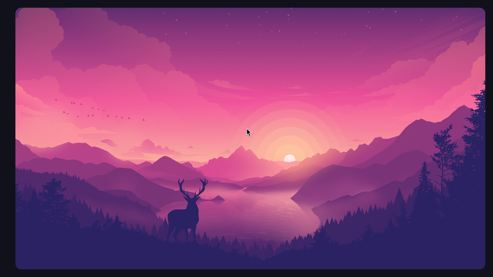

# ignis-borders

A simple example using Ignis, GTK, and Cairo to draw rounded borders for your hyprland

## Example

Here's an example with it's accompanying style.json configuration



```json
{
    "borders": {
        "enabled": true,
        "color": "#11111b",
        "gap": 20.0,
        "top": {
            "enabled": true,
            "height": 20.0
        },
        "left": {
            "enabled": true,
            "width": 40.0
        },
        "right": {
            "enabled": true,
            "width": 20.0
        },
        "bottom": {
            "enabled": true,
            "height": 20.0
        },
        "corners": {
            "enabled": true,
            "radius": 15,
            "topleft": {
                "enabled": true,
                "radius": 25
            },
            "topright": {
                "enabled": true
            },
            "bottomleft": {
                "enabled": true
            },
            "bottomright": {
                "enabled": true
            }
        }
    }
}
```

## Full Config

| Property | Explanation |
| --- | --- |
| borders.enabled | Flag to enabled/disable the borders as a whole |
| borders.color | Hex value of the solid color, can include alpha |
| borders.gradient.[start/end].color | The start color of the gradient |
| borders.gradient.[start/end].x | The x position (between 0-1) of the start/end of the gradient |
| borders.gradient.[start/end].y | The y position (between 0-1) of the start/end of the gradient |
| borders.gap | The extra distance to add on every side |
| borders.[top/left/right/bottom].enabled | Flag to enable/disable a specific side of the border |
| borders.[left/right].width | Size in pixels for the border on the left or right sides  |
| borders.[top/bottom].height | Size in pixels for the border on the top and bottom sides |
| borders.corners.enabled | Flag to enable/disable the rounding of corners |
| borders.corners.radius | Main radius to use for the rounding of the corners |
| boders.corners.[topleft,topright,bottomleft,bottomright].enabled | Flag to enable/disable a specific rounded corner |
| boders.corners.[topleft,topright,bottomleft,bottomright].radius | Override of the radius for a specific rounded corner |

```json
{
    "borders": {
        "enabled": true,
        "color": "#11111b",
        "gradient": {
            "start": {
                "color": "#FF0000",
                "x": 0,
                "y": 0
            },
            "end": {
                "color": "#00FF00",
                "x": 1,
                "y": 1
            }
        },
        "gap": 20.0,
        "top": {
            "enabled": true,
            "height": 20.0
        },
        "left": {
            "enabled": true,
            "width": 40.0
        },
        "right": {
            "enabled": true,
            "width": 20.0
        },
        "bottom": {
            "enabled": true,
            "height": 20.0
        },
        "corners": {
            "enabled": true,
            "radius": 15,
            "topleft": {
                "enabled": true,
                "radius": 25
            },
            "topright": {
                "enabled": true,
                "radius": 25
            },
            "bottomleft": {
                "enabled": true,
                "radius": 25
            },
            "bottomright": {
                "enabled": true,
                "radius": 25
            }
        }
    }
}
```


